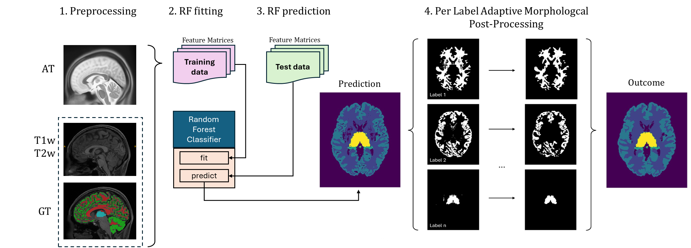
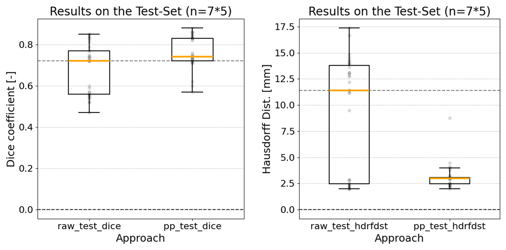
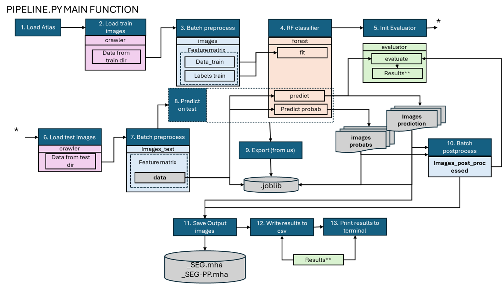
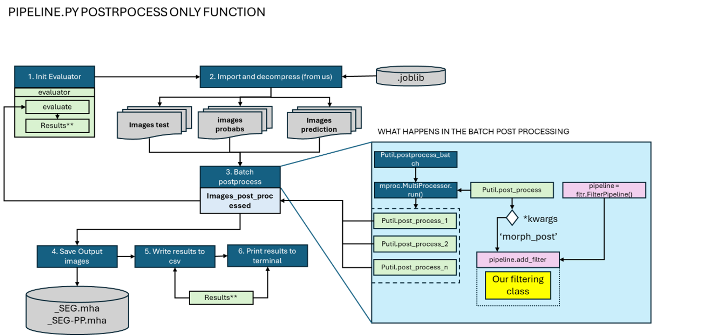

### 102475-HS2024-0: Medical Image Analysis Lab
# Adaptive Morphological Post-processing for Enhanced Brain Segmentation Accuracy


## Project Overview

This project introduces a Python-based Medical Image Analysis (MIA) pipeline for automated brain region segmentation from MRI scans. The goal is to enhance segmentation accuracy using an adaptive morphological post-processing workflow that addresses common artifacts such as protrusions, insulations, and small holes.

The project leverages machine learning techniques and morphological operations to improve the quality of brain structure segmentation, which is crucial for disease diagnosis, treatment planning, and progression monitoring.

### General process overview:


### Results with the current implementation 
- Post Processing significantly (p<<0.001) increased Dice Coefficient.
- Post Processing significantly (p<<0.001) decreased Hausdorff Distance.
  


## Features
- **Automated Brain Segmentation:** Segments Grey Matter, White Matter, Hippocampus, Amygdala, and Thalamus from MRI scans.
- **Adaptive Morphological Post-Processing:**
  - Data-driven opening
  - 2D hole-filling
- **Quantitative and Qualitative Evaluation:** Dice coefficients, Hausdorff distances, visual inspections and statistical significance tests.
- **Machine Learning Integration:** Random Forest Classifier with feature extraction and registration.


## Project Structure
```
├── dataset/                      # MRI datasets and ground truth labels
│   ├── atlas/                    # Atlas reference data
│   ├── train/                    # Training dataset with affine transformation files
│   └── test/                     # Testing dataset with affine transformation files
├── mialab/                       # Core source code for the MIA pipeline
│   ├── data/                     # Data structures and handling
│   ├── filtering/                # Preprocessing, feature extraction, and postprocessing
│   └── utilities/                # Utility functions for file access and multiprocessing
├── report_scripts/               # Scripts for results visualization and statistical tests
├── inferences/                   # Folder storing the joblib compressed RF predictions
├── final_report/                 # Folder containing the scientific report of this project
├── test/                         # Test scripts for pipeline validation
├── pipeline.py                   # Main script to run the full pipeline
├── prepare_data.py               # Script for preparing the dataset
├── requirements.txt              # List of required Python libraries
├── setup.py                      # Setup script for packaging and installation
├── LICENSE                       # License information
├── README.md                     # Project documentation
└── .gitignore                    # Files and directories to be ignored by Git
```

## Technical Requirements
- Python Version: 3.10.7
- Libraries Used:
  - scikit-learn==1.4.2
  - SimpleITK==2.3.1
  - joblib==1.4.0


## Installation

1. Clone the repository:
``` bash
git clone <repo-url>
cd mialab
```
2. Create a virtual environment:
``` bash
python -m venv venv
source venv/bin/activate
```
3. Install the required packages:
``` bash
pip install -r requirements.txt
```

## Usage
### Running the Full Pipeline
The dataset (atlas, train and test) is in the folder "dataset". To execute the pipeline we must add parser arguments to this folder:

NOTE: Make sure to call this while being in the mialab folder, the paths are relative.
```bash
python pipeline.py --data_atlas_dir "./dataset/atlas" --data_train_dir "./dataset/train" --data_test_dir "./dataset/test"
```
After execution the pipeline script will create an output folder called "mia-results".

### Key Pipeline Steps:

1. Preprocessing: Skull stripping, intensity normalization, image registration.
2. Segmentation: Training a Random Forest classifier and predicting tissue labels.
3. Post-Processing: Applying data-driven opening and 2D hole-filling operations.
   



## Executing the post-processing pipeline

This is relevant if changes to the post processing pipeline are to be evaluated without rerunning all previous steps. It requires running the "full pipeline" prior to have access to a joblib element representing the trained RF classifier.

```bash
python pipeline.py --postprocess "inferences/2024-11-10-23-09-30.joblib"
```
   


## Report

For more informations read the report contained in this repo:
```
\final_report\MIALab_Portmann_Boegli_Inacio.pdf
```

## Group Members
José Miguel PINTO INÁCIO | jose.inacio@students.unibe.ch

Max BÖGLI | max.boegli@students.unibe.ch

Marco Daniel PORTMANN | marco.portmann@students.unibe.ch

## Useful links

-   [MIA24 Slack](mialab2024.slack.com)

January 2025
